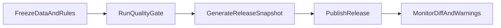

# 版本化发布与回滚策略（数据版本 + 规则版本）

## 目标

- 任何一次发布都能回答三件事：
  - 用的是哪一版游戏数据？
  - 用的是哪一版规则集？
  - 出现偏差时如何快速回退？

## 版本对象

1. 数据版本（Data Version）
   - 来源：六个核心 JSON 的快照与摘要。
   - 标识：`dataVersionId`（建议 `YYYYMMDD-N`）。
2. 规则版本（Rule Version）
   - 来源：`calc-core` 规则定义与 custom 迁移批次。
   - 标识：`ruleVersionId`（建议 `vX.Y.Z`）。
3. 发布版本（Release Version）
   - 将数据版本 + 规则版本绑定，形成对外可回溯版本。

## 元数据文件

- 数据版本：`versions/data-version.json`
- 规则版本：`versions/rule-version.json`
- 发布快照：`versions/releases/release-<timestamp>.json`

## 发布流程（标准）

### 步骤说明

1. 冻结待发布的数据与规则分支。
2. 执行 `npm run quality:gate`。
3. 执行 `npm run release:snapshot` 生成发布快照。
4. 发布后监控：
   - Top20 样例差异
   - warnings 数量变化
   - 用户反馈异常

## 回滚策略

### 触发条件

- P0 warning 激增。
- Top20 关键样例出现不可解释偏差。
- 线上计算结果出现大面积回归失败。

### 回滚等级

1. 规则回滚（优先）
   - 保持数据版本不变，仅回退 `ruleVersionId`。
2. 数据回滚
   - 保持规则版本不变，回退 `dataVersionId`。
3. 整体回滚
   - 同时回退数据与规则到上一稳定快照。

### 回滚步骤

1. 选定目标快照（`versions/releases/*.json`）。
2. 将 `versions/data-version.json` 与 `versions/rule-version.json` 恢复到目标值。
3. 重新执行 `npm run quality:gate` 验证。
4. 记录回滚原因、影响范围和修复计划。

## 发布节奏建议

- MVP阶段：每周一次稳定发布窗口。
- 规则高频迁移期：小步发布，但每次都要生成快照。
- 大版本（含数据变更）：发布前强制补齐差异报告。

## 责任分工建议

- 计算内核负责人：确认规则版本与回归结果。
- 数据治理负责人：确认数据版本与审计结果。
- 发布负责人：执行快照、发布、回滚决策。
