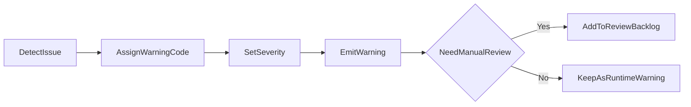

# 规则歧义处理策略与 Warnings 分类规范

## 目标

- 当规则语义不确定时，优先保证“可见风险”，而不是“静默猜测”。
- 让用户、维护者、审计脚本看到同一种风险分类语言。

## 核心原则

1. 不静默兜底：无法确定语义时必须输出 warning。
2. 结果可计算优先：在可计算前提下输出风险说明，不直接中断计算。
3. 分类可追踪：每条 warning 应可映射到统一 warning code。
4. 人工闭环：高风险歧义进入待复核列表，不长期滞留在模糊状态。

## Warning 分级

- `P0`：结果可能严重失真（例如关键倍率语义未知）。
- `P1`：结果可参考但存在偏差风险（例如条件语义未完全覆盖）。
- `P2`：信息性告警（例如使用了默认策略但影响较小）。

## Warning 分类（v1）

| Code | 级别 | 说明 | 示例 |
|---|---|---|---|
| `WARN_UNMAPPED_KEY` | P0 | 检测到未映射 blackboard key | `cnt`/`prob` 等无法直接归一化 |
| `WARN_AMBIGUOUS_SEMANTIC` | P0 | 同名 key 在当前上下文语义不唯一 | `atk` 在天赋/技能/模组语义冲突 |
| `WARN_PARTIAL_RULE_COVERAGE` | P1 | 技能仅部分规则覆盖 | 只覆盖了主流，额外流未补齐 |
| `WARN_ASSUMPTION_APPLIED` | P1 | 使用默认假设继续计算 | 默认按稳定阶段处理暖机 |
| `WARN_MANUAL_REVIEW_REQUIRED` | P1 | 标记需人工复核 | 进入 custom 待人工清单 |
| `WARN_INFO_LIMITATION` | P2 | MVP边界提示 | 召唤物/元素损伤未纳入 |

## 处理流程

## 与规则迭代流程的衔接

- 新增规则前：先确认是否会消除既有 warning code。
- 新增规则后：必须验证 warning 数量是否下降或解释一致。
- 回归测试应覆盖“warning 触发”与“warning 消失”两种路径。

## 对外展示建议

- UI 展示 `级别 + 文案 + code` 三段信息。
- 对 `P0/P1` 提供“查看规则来源/待复核说明”的入口。
- 导出报告时保留 warning code，方便跨版本比对。
