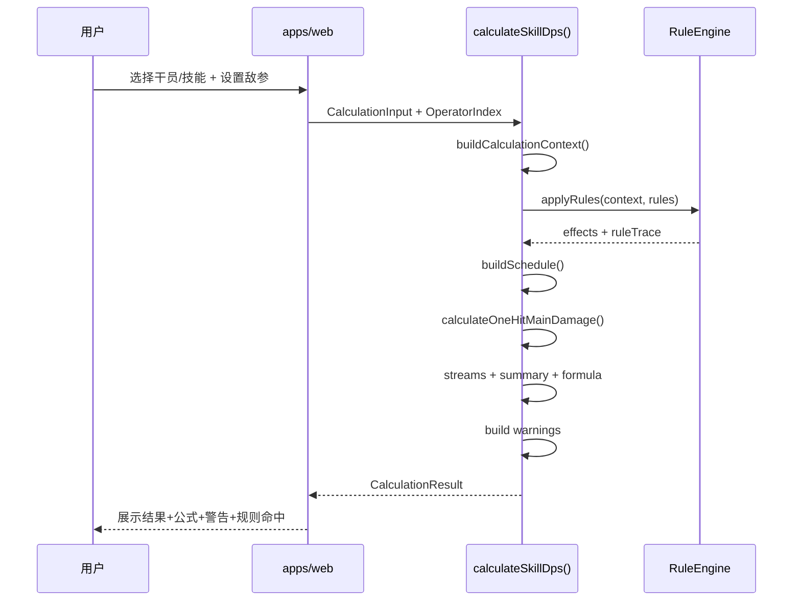
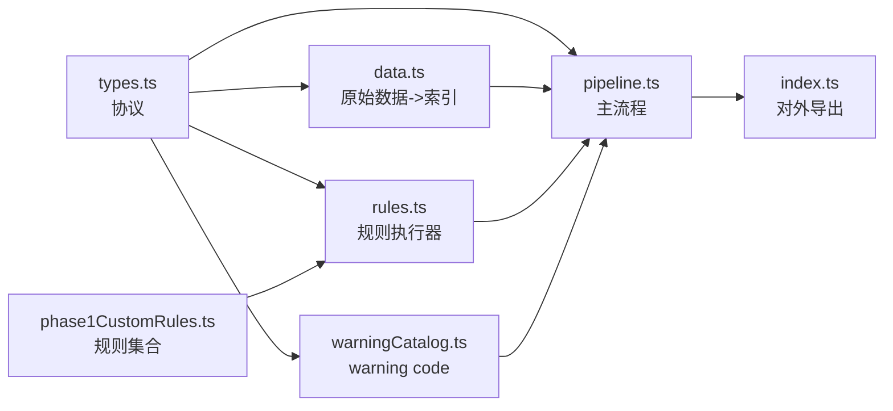
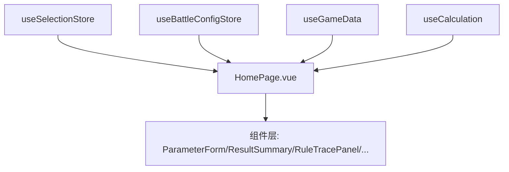
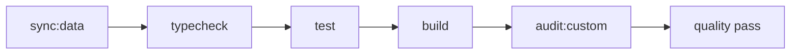
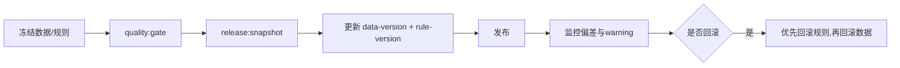

# QMcalculator 完工态代码蓝图（Code Plan）

> 目标：这份文档描述“项目完工后”应具备的工程架构、代码组织与交付标准。  
> 使用方式：按本文档的目录树、模块职责、时序图与阶段清单推进实现，完成后架构应与本文一致。

## 1. 完工定义（Definition of Done）

完工态需要同时满足：

1. 用户可在 `apps/web` 完成“选干员 -> 选技能 -> 配置敌参 -> 查看 DPS / 总伤 / 解释”闭环。
2. 所有计算逻辑仅在 `packages/calc-core`，UI 不直接解析 raw blackboard。
3. 所有技能计算统一进入 `calculateSkillDps()`，并输出：
   - `summary`、`schedule`、`streams`、`breakdown`
   - `formula`、`ruleTrace`、`warnings`
4. 质量门禁 `quality:gate` 全通过，且可稳定执行：
   - `sync:data` -> `typecheck` -> `test` -> `build` -> `audit:custom`
5. 发布可追溯：存在数据版本、规则版本、发布快照，且回滚流程可执行。

---

## 2. 完工态目录结构

```text
QMcalculator/
├─ apps/
│  └─ web/
│     ├─ src/
│     │  ├─ pages/
│     │  │  └─ HomePage.vue
│     │  ├─ components/
│     │  │  ├─ ParameterForm.vue
│     │  │  ├─ ResultSummary.vue
│     │  │  ├─ RuleTracePanel.vue
│     │  │  ├─ FormulaViewer.vue
│     │  │  ├─ StreamsTable.vue
│     │  │  ├─ BreakdownTable.vue
│     │  │  ├─ OperatorInfobox.vue
│     │  │  ├─ ArticleToc.vue
│     │  │  ├─ ArticleTitleBar.vue
│     │  │  └─ ArticleFooter.vue
│     │  ├─ composables/
│     │  │  ├─ useGameData.ts
│     │  │  └─ useCalculation.ts
│     │  ├─ stores/
│     │  │  ├─ useSelectionStore.ts
│     │  │  └─ useBattleConfigStore.ts
│     │  └─ router/index.ts
│     └─ package.json
├─ packages/
│  └─ calc-core/
│     ├─ src/
│     │  ├─ index.ts
│     │  ├─ types.ts
│     │  ├─ data.ts
│     │  ├─ pipeline.ts
│     │  ├─ rules.ts
│     │  ├─ phase1CustomRules.ts
│     │  └─ warningCatalog.ts
│     ├─ __tests__/
│     │  ├─ unit/
│     │  ├─ regression/
│     │  └─ fixtures/
│     └─ package.json
├─ scripts/
│  ├─ sync-game-data.mjs
│  ├─ audit-custom-coverage.mjs
│  ├─ generate-custom-docs.mjs
│  ├─ quality-gate.mjs
│  └─ release-snapshot.mjs
├─ versions/
│  ├─ data-version.json
│  ├─ rule-version.json
│  └─ releases/
├─ docs/
│  ├─ architecture.md
│  ├─ policy/ambiguity-warning-policy.md
│  ├─ quality/quality-gate-v1.md
│  ├─ ops/release-rollback-strategy.md
│  ├─ rules/top20-priority-migration.md
│  └─ roadmap/completion-engineering-code-plan.md
└─ package.json
```

---

## 3. 总体分层架构图

```mermaid
flowchart TD
  UI[apps/web<br/>页面+状态管理] --> CORE[@qm/calc-core<br/>计算内核]
  CORE --> RESULT[CalculationResult<br/>summary/schedule/streams/formula/ruleTrace/warnings]
  DATA[JSON 原始数据<br/>character/skill/uniequip/...]
  DATA --> INDEX[buildOperatorIndexFromRaw]
  INDEX --> UI
  SCRIPTS[scripts<br/>sync/audit/docs/quality/release] --> DATA
  SCRIPTS --> DOCS[docs + versions]
```

分层约束：

- `apps/web` 只能调用 `@qm/calc-core` 导出的 API，不承载公式逻辑。
- `packages/calc-core` 不依赖 UI 框架，只输出纯 TypeScript 数据结构。
- `scripts` 是生产保障层，不进入业务计算路径。

---

## 4. 核心计算时序图（单次请求）



---

## 5. `calc-core` 内部模块设计



### 5.1 稳定对外 API（目标）

```ts
export function buildOperatorIndexFromRaw(raw: RawGameData): OperatorIndex;
export function calculateSkillDps(
  input: CalculationInput,
  index: OperatorIndex,
  rules?: RuleDefinition[],
): CalculationResult;
```

### 5.2 主流程伪代码（目标）

```ts
function calculateSkillDps(input, index, rules = defaultSkillRules) {
  const context = buildCalculationContext(input, index);
  const { effects, trace } = applyRules(context, rules);
  const schedule = buildSchedule(context, effects);
  const main = calculateOneHitMainDamage(context, effects);
  const streams = buildDamageStreams(main, schedule, effects, context);
  const summary = summarize(streams, schedule);
  const formula = buildFormula(main, schedule, summary);
  const warnings = buildWarnings(context, effects);
  return { summary, schedule, streams, breakdown, formula, ruleTrace: trace, warnings };
}
```

---

## 6. 数据与协议设计（完工态）

### 6.1 输入协议（当前基础 + 目标增强）

当前基础输入（已具备）：

- `selection.operatorId`
- `selection.skillId`
- `enemy.defense`
- `enemy.magicResistance`
- `battle.conditionEnabled`
- `battle.minPhysicalDamageRatio`

目标增强输入（完工前补齐）：

- 养成参数：精英阶段、等级、技能等级、信赖、潜能
- 模组参数：模组开关/等级/分支
- 战斗参数扩展：可选场景参数（后续阶段）

### 6.2 输出协议（稳定）

- `summary`: `hitDamage/totalDamage/dps`
- `schedule`: `attackInterval/attackCount/duration/...`
- `streams`: `MAIN/OTHER_*` 伤害流
- `breakdown`: 可读分解项
- `formula`: `mainHit/schedule/summary` 三段公式链路
- `ruleTrace`: 规则命中记录
- `warnings`: 风险可见化

---

## 7. 规则系统设计

### 7.1 规则协议

```ts
interface RuleDefinition {
  id: string;
  scope: "skill";
  match: (context: CalculationContext) => boolean;
  transform: (effects: NormalizedEffects, context: CalculationContext) => NormalizedEffects;
  note: string;
}
```

### 7.2 规则执行策略

1. 先做 blackboard 归一化，得到 `NormalizedEffects`。
2. 按规则列表顺序执行 `match -> transform`。
3. 每次命中都记录 `ruleTrace`。
4. 无法覆盖语义必须落 warning，不允许静默猜测。

### 7.3 warning 设计（必须可追踪）

- `WARN_UNMAPPED_KEY`
- `WARN_AMBIGUOUS_SEMANTIC`
- `WARN_PARTIAL_RULE_COVERAGE`
- `WARN_ASSUMPTION_APPLIED`
- `WARN_MANUAL_REVIEW_REQUIRED`
- `WARN_INFO_LIMITATION`

---

## 8. 前端工程设计（完工态）



前端原则：

- 页面只做“参数采集 + 调用内核 + 展示结果”。
- 所有展示组件只接收 props，不自行发起计算。
- 结果渲染优先可解释性（warning/ruleTrace/formula）而非仅数字。

---

## 9. 测试、门禁与发布架构

### 9.1 测试分层

- `calc-core unit`：公式、规则、归一化基础逻辑
- `calc-core regression`：Top20 样例 + 条件开关双样例
- `web smoke`：关键交互链路（最小用例）

### 9.2 门禁流图



### 9.3 发布流图



---

## 10. 按阶段落地计划（工程施工顺序）

### 阶段 A：协议与主链打通

- 冻结 `types.ts` 输入输出协议
- 打通 `data.ts -> pipeline.ts -> web`
- 页面能展示 `summary + warnings`

### 阶段 B：规则迁移与解释增强

- 按 `Top20` 推进规则迁移
- 完善 `ruleTrace` 与 warning 文案
- 扩充 `streams` 与 `formula` 细节

### 阶段 C：质量与发布闭环

- 完成 regression + audit 阈值治理
- 固化 `quality:gate` 与 CI 一致性
- 产出可回滚发布快照

---

## 11. 最终验收清单（你可以直接勾选）

- [ ] `apps/web` 无业务公式逻辑，计算全部来自 `@qm/calc-core`
- [ ] `calculateSkillDps()` 是唯一计算入口
- [ ] 结果固定包含 `summary/schedule/streams/formula/ruleTrace/warnings`
- [ ] 未映射/歧义语义必有 warning，不静默
- [ ] Top20 迁移覆盖率达到阶段目标
- [ ] `npm run quality:gate` 可稳定通过
- [ ] `versions` 中有可追溯数据版本、规则版本、发布快照

---

## 12. 开发执行建议（实操）

1. 每次只做一个小闭环（规则 + 测试 + 文档）。
2. 每次合并前跑 `quality:gate`，避免局部通过全局失败。
3. 对外沟通统一引用 `ruleId`、`warning code`、`version id`，保证可追责。
4. 文档与代码同迭代更新，避免“代码在前、文档滞后”。

> 一句话：完工态不是“能算”，而是“可解释、可回归、可发布、可回滚地稳定算”。
